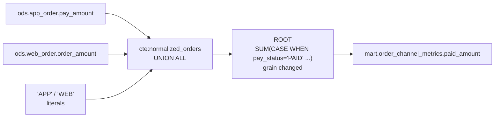
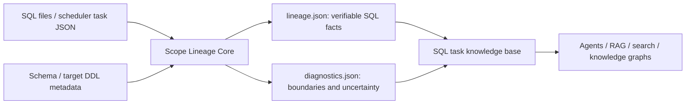

# Scope Lineage

[](https://github.com/realyin/scope-lineage/actions/workflows/ci.yml)
[](pyproject.toml)
[](LICENSE)

[中文](README.zh-CN.md) | English

**Turn Spark/Hive SQL into structured, traceable facts for Agents, RAG, search, and AI knowledge
bases.**

> Table lineage tells you where data comes from. Scope Lineage tells you how it became what it is.

Scope Lineage is an offline static analyzer that preserves CTEs, subqueries, field expressions,
JOINs, filters, aggregates, windows, and uncertainty as versioned `lineage.json` and
`diagnostics.json` artifacts. AI applications can reason from addressable evidence instead of
guessing from raw SQL or a flat table-lineage edge.

This repository contains the open-source Core: SQL/task ingestion, scope parsing, column-level
lineage, and diagnostics. It does not require a Spark cluster, database credentials, or an LLM.
Embeddings, knowledge-graph storage, and business-semantic generation remain downstream concerns.

## See the difference

Column-level lineage is not rare. What is rare is being right about the hard parts of a query and
being explicit about the parts you cannot prove.

The included [`order_channel_metrics.sql`](examples/sql/order_channel_metrics.sql) normalizes two
source tables through a `UNION ALL` CTE and then aggregates:

```sql
WITH normalized_orders AS (
  SELECT pay_amount, pay_status, 'APP' AS order_channel
  FROM ods.app_order
  UNION ALL
  SELECT order_amount AS pay_amount, order_status AS pay_status, 'WEB' AS order_channel
  FROM ods.web_order
)
SELECT order_channel,
       SUM(CASE WHEN pay_status = 'PAID' THEN pay_amount ELSE 0 END) AS paid_amount
FROM normalized_orders
GROUP BY order_channel;
```



Two things here are easy to get wrong.

**`order_channel` is a literal, not a column.** For reference, SQLLineage 1.5.8
(`sqllineage -f <file> -l column --dialect sparksql`) reports:

```text
mart.order_channel_metrics.order_channel <- normalized_orders.order_channel
```

No such column exists — the value is `'APP'` or `'WEB'` depending on the branch. Scope Lineage
records it as generated rather than read:

```json
{
  "column": "order_channel",
  "source_kind": "generated",
  "physical_sources": [],
  "generated_sources": [
    {"source_type": "CONSTANT", "value": "'APP'", "transform": "CONSTANT"},
    {"source_type": "CONSTANT", "value": "'WEB'", "transform": "CONSTANT"}
  ]
}
```

**`paid_amount` reads a differently named column in each branch.** The expression is kept verbatim
and both branches are resolved to their physical columns:

```json
{
  "column": "paid_amount",
  "transform": "AGGREGATE",
  "expression": "SUM(CASE WHEN `normalized_orders`.`pay_status` = 'PAID' THEN `normalized_orders`.`pay_amount` ELSE 0 END)",
  "physical_sources": [
    {"table": "ods.app_order", "column": "pay_amount",   "transform": "AGGREGATE"},
    {"table": "ods.web_order", "column": "order_amount", "transform": "AGGREGATE"},
    {"table": "ods.app_order", "column": "pay_status",   "transform": "AGGREGATE"},
    {"table": "ods.web_order", "column": "order_status", "transform": "AGGREGATE"}
  ],
  "trace_complete": true
}
```

Both excerpts are real output, not hand-written summaries. Reproduce them with:

```bash
scope-lineage parse \
  --sql-file examples/sql/order_channel_metrics.sql \
  --schema examples/metadata/schema_info.json \
  --target-ddl-metadata examples/metadata/target_tables \
  --out /tmp/scope-lineage
# then read end_to_end_lineage in /tmp/scope-lineage/order_channel_metrics/lineage.json
```

### Compared with SQLLineage

| | SQLLineage 1.5.8 `-l column` | Scope Lineage |
| --- | --- | --- |
| CTE / JOIN column lineage | resolved | **the same sources — the two agree** |
| Literal projections | reported as a column that does not exist | `CONSTANT` under `generated_sources` |
| UNION branch to physical table | stops at the CTE for some columns | resolved per branch |
| `SELECT *` with schema metadata | `mart.t.* <- ods.s.*` | expanded to concrete columns |
| Transform type and expression | not reported | `DIRECT` / `EXPRESSION` / `AGGREGATE` / `CONDITIONAL` plus SQL |
| Target field bound to DDL position | not reported | `target_field_binding`, ordinals |
| Multi-statement scripts | merged into one result | one artifact pair per write statement |
| What could not be proven | not reported | `diagnostics.json` |

To be clear about where this does *not* differ: on a straightforward CTE-and-JOIN task such as
[`customer_profile_daily.sql`](examples/sql/customer_profile_daily.sql), both tools return the same
physical source set for every target column. The difference is the evidence attached to each edge —
the expression, the transform type, the grain effect, and the diagnostics — not the edge itself.

The same task also identifies window/dedup scopes, separates JOIN keys from row filters, binds
projected fields to target DDL positions, and reports facts it cannot prove. See the complete
[`lineage.json` contract](docs/zh-CN/lineage-json.md).

## Questions these facts can support

After indexing artifacts from a SQL corpus, downstream applications can answer questions such as:

- How was `customer_profile_snapshot.order_count_30d` calculated?
- Which target fields depend on `dwd.order_detail.order_id`?
- Which tasks use `ROW_NUMBER` for deduplication?
- Which lineage traces are incomplete or ambiguous, and why?

## Why these facts matter to AI systems

| Raw-SQL limitation | Structured fact | Reliable downstream capability |
| --- | --- | --- |
| Long SQL is expensive and easy for a model to misread | `scope_profile.steps[]` and `scope_graph` | staged retrieval and scope-by-scope explanation |
| Table edges cannot answer column questions | `end_to_end_lineage[].physical_sources[]` | column impact analysis and graph edges |
| Final sources do not explain intermediate calculation | `field_mapping_chains[].ordered_steps[]` | evidence-backed transformation explanations |
| JOIN/filter/aggregate logic is trapped in text | typed `logic_blocks[]` and detail objects | rule search, governance review, logic comparison |
| SQL aliases may not be target column names | `target_field_binding` and ordinals | DDL-authoritative target lineage |
| Models tend to turn ambiguity into confident answers | trace status, `ambiguities`, and fact gaps | confidence-aware RAG that can refuse unsupported claims |
| Scheduler and SQL dependencies live separately | task dependencies plus table/scope graphs | task-table-column knowledge graphs |

The value is not a fixed natural-language summary. It is a reproducible, addressable fact layer:
an upper-layer answer can point back to a scope, expression, physical field, and diagnostic reason.

## What it provides

- Offline static analysis for Spark/Hive warehouse SQL; no Spark cluster or query execution is
  required.
- Inputs from one `.sql` file, an exported scheduler task JSON, or a recursive task directory.
- `INSERT INTO`, `INSERT OVERWRITE`, CTAS, and `MERGE` write statements.
- Preserved CTE, subquery, JOIN, UNION/UNION ALL, aggregate, window, and intermediate scopes.
- Field mappings, expressions, physical source fields, end-to-end lineage, and scope dependencies.
- Optional Schema metadata for `SELECT *` expansion, field types, and comments.
- Optional target DDL/Schema metadata for authoritative positional INSERT binding.
- Declared upstream and downstream task dependencies retained from task JSON.
- Explicit status and diagnostics for parse failures, syntax recovery, ambiguity, and missing
  metadata; guesses are not presented as proven facts.
- Versioned JSON Schema contracts validated before artifacts are written.

## How it supports an AI knowledge base



The Core owns deterministic parsing and fact representation. It does not force a vector database,
graph database, or model choice. The same facts can support code search, task Q&A, impact analysis,
governance review, and later business-knowledge generation.

## Why another project

The open-source ecosystem already contains mature projects; Scope Lineage does not claim to be the
first SQL parser or lineage tool:

- [SQLGlot](https://github.com/tobymao/sqlglot) is a general SQL parser, transpiler, and optimizer,
  and is the parsing engine used by this project.
- [SQLLineage](https://sqllineage.readthedocs.io/) provides general table- and column-level SQL
  lineage.
- [OpenLineage](https://openlineage.io/docs/guides/spark/) focuses on standardized lineage events
  collected from running Spark jobs.
- [DataHub](https://github.com/datahub-project/datahub/blob/master/docs/api/tutorials/lineage.md) is
  a full metadata platform that can also infer column lineage from SQL.

Scope Lineage specializes in offline Spark/Hive tasks and unifies intermediate scopes, field
transformations, task dependencies, metadata enrichment, end-to-end evidence, and parse diagnostics
as a versioned fact contract for AI knowledge bases. Based on the published positioning of the
projects above, we have not found an open-source tool with exactly this complete objective and
artifact boundary. This is a direction for the project to validate and build—not a claim that no
other SQL-lineage solution exists.

## Install

For an isolated CLI environment, install the published package from PyPI with `pipx`:

```bash
pipx install scope-lineage
scope-lineage --help
```

Alternatively, install it in a Python virtual environment:

```bash
python3 -m venv .venv
source .venv/bin/activate
python -m pip install scope-lineage
```

Install from source when contributing:

```bash
git clone https://github.com/realyin/scope-lineage.git
cd scope-lineage
python3 -m venv .venv
source .venv/bin/activate
python -m pip install --upgrade pip
python -m pip install .
```

The PyPI distribution and CLI are named `scope-lineage`; the Python import namespace is
`scope_lineage`. The current `0.1.x` series is Alpha. See the
[Chinese installation and usage guide](docs/zh-CN/getting-started.md) for a self-contained tutorial.

## Quick start

Parse one SQL file:

```bash
scope-lineage parse \
  --sql-file examples/sql/customer_profile_daily.sql \
  --schema examples/metadata/schema_info.json \
  --target-ddl-metadata examples/metadata/target_tables \
  --out /tmp/scope-lineage
```

Parse one scheduler task export in the current `meta/query_time/data_source` format:

```bash
scope-lineage parse \
  --task-file examples/tasks/customer/customer_profile_daily.json \
  --schema examples/metadata/schema_info.json \
  --target-ddl-metadata examples/metadata/target_tables \
  --out /tmp/scope-lineage
```

Parse a task directory recursively:

```bash
scope-lineage parse \
  --input-dir examples/tasks \
  --schema examples/metadata/schema_info.json \
  --target-ddl-metadata examples/metadata/target_tables \
  --out /tmp/scope-lineage-corpus
```

Nested input paths are preserved in the output. When one task contains multiple supported write
statements, each statement receives its own artifacts. Use `--allow-partial` only when callers
explicitly accept invalid inputs or failed statements. See the complete synthetic corpus in
[examples/README.zh-CN.md](examples/README.zh-CN.md) and the detailed
[Core input formats](docs/zh-CN/input-formats.md).

Task-level contract 2.0 is the default: one ordered table-state artifact per task, covering
statement order, DELETE/TRUNCATE/UPDATE, and row-membership lineage:

~~~bash
scope-lineage parse \
  --task-file examples/tasks/customer/customer_profile_daily.json \
  --schema examples/metadata/schema_info.json \
  --schema-fallback examples/metadata/schema_info.csv \
  --quality-policy strict \
  --out /tmp/scope-lineage-v2
~~~

See [Task Lineage 2.0](docs/zh-CN/task-lineage-v2.md).

### Migrating from the removed contract 1.0

The standalone contract-1.0 output mode (one artifact per projection write) has been
removed. Migration is mostly re-pointing:

- A task document's `statement_lineage` maps each `statement_id` to exactly the former
  v1 statement document shape, in `statement_sequence` order — code that consumed a v1
  `lineage.json` consumes one entry unchanged, and `lineage.schema.json` remains that
  entry's schema.
- Task-level answers live at the top level: `end_to_end_lineage` (final-state view),
  `table_state_graph`, `final_table_states`, and `task_dependencies`.
- `render` and `render_mapping_markdown` accept a task document (one mapping section per
  statement) and still accept a single statement document.
- The library writer is `write_task_lineage`; the statement converter `to_lineage_dict`
  stays. `write_lineage` is gone.

Render a human- and machine-readable field-mapping document (`mapping.md`) from artifacts
that already exist:

```bash
scope-lineage render --lineage /tmp/scope-lineage-corpus
```

Each statement's `mapping.md` is written next to its `lineage.json` (`--out` mirrors the
tree elsewhere). The document is a derived view of the contract — every fact in it links
back to `lineage.json` by contract ids. See the
[mapping document guide (Chinese)](docs/zh-CN/mapping-doc.md).

### Catalog-prefix normalization

Core preserves fully qualified table names by default. For example,
`warehouse_catalog.ods.orders` remains fully qualified in `source_tables` and physical field
sources. If a deployment uses both `warehouse_catalog.ods.orders` and `ods.orders` for the same
physical table, explicitly configure the catalog names that may be removed:

```bash
scope-lineage parse \
  --input-dir examples/tasks \
  --catalog-prefixes warehouse_catalog,spark_catalog \
  --out /tmp/scope-lineage-corpus
```

Python API and fixed deployment environments may instead use:

```bash
export SCOPE_LINEAGE_CATALOG_PREFIXES="warehouse_catalog,spark_catalog"
```

The CLI option overrides the environment variable; when neither is set, no catalog is removed.
List only confirmed leading catalog names, not database names. This is a batch/deployment parsing
policy rather than a per-task business fact, so it does not belong in task JSON. Run task groups
separately when they require different policies.

## Inputs

Task JSON may use the current scheduler-export wrapper:

```json
{
  "meta": {
    "task_id": "demo-task-1002",
    "task_name": "customer_profile_daily",
    "input_tables": ["ods.customer_base", "dwd.order_detail"],
    "output_tables": ["mart.customer_profile_snapshot"],
    "upstream_tasks": [
      {"task_id": "demo-task-1001", "task_name": "order_detail_daily"}
    ],
    "downstream_tasks": [],
    "sql": "INSERT OVERWRITE TABLE ..."
  },
  "query_time": "2026-08-02 10:00:00",
  "data_source": "scheduler_api_demo"
}
```

Rich JSON with `columnIndex` and DDL is the recommended source-schema format. A parseable DDL
defines field order; without DDL, fields are sorted by `columnIndex`:

```json
{
  "table_name": "ods.customer_base",
  "schema": [
    {"columnName": "customer_id", "columnType": "bigint", "columnIndex": 0},
    {"columnName": "customer_name", "columnType": "string", "columnIndex": 1}
  ],
  "ddl": "CREATE TABLE ods.customer_base (customer_id BIGINT, customer_name STRING)"
}
```

CSV is a compatibility fallback. Rows for each table are read in file order:

```csv
table_name,column_name,column_type,column_comment
ods.customer_base,customer_id,bigint,Synthetic customer identifier
ods.customer_base,customer_name,string,Synthetic customer name
```

CSV has no explicit `columnIndex` or DDL validation, so do not rely on it for `SELECT *` when the
exporter cannot guarantee row order. Rich JSON files or directories are accepted by `--schema`;
`--target-ddl-metadata` accepts the same structure with one document per target table. A parseable
DDL is the primary authority for target structure and order. Source Schema metadata resolves fields
and expands `SELECT *`; target metadata provides authoritative target order for INSERT binding.

## Outputs

Each supported write statement creates only two Core artifacts:

```text
<output>/<task-id>/
├── lineage.json
└── diagnostics.json
```

`lineage.json` groups its facts as follows:

| Questions | Keys |
| --- | --- |
| What is written, and how? | `target_table`, `stmt_kind`, `target_partition_*` |
| What physical data is read? | `source_tables`, `related_metadata` |
| How are CTEs, subqueries, UNIONs, and ROOT connected? | `scopes`, `scope_graph` |
| Where do JOINs, filters, aggregates, and windows occur? | `scopes.*.logic_blocks` |
| How does a field move through query blocks? | `scopes.*.outputs`, `field_mapping_chains` |
| Which physical fields prove each target field? | `end_to_end_lineage` |
| Is the answer complete or ambiguous? | trace status, missing reasons, and ambiguities |

`diagnostics.json` contains complete `warnings[]`, structural `stats`, and
`lineage_fact_gaps[]` with affected objects, missing facts, evidence paths, and downstream impact.
AI consumers should read both documents and must not treat recovered syntax, ambiguity candidates,
or missing metadata as proven lineage.

Documentation:

- [Installation and usage guide (Chinese)](docs/zh-CN/getting-started.md)
- [Documentation map and question-to-field index](docs/zh-CN/README.md)
- [`lineage.json` keys, nested values, examples, and consumption rules](docs/zh-CN/lineage-json.md)
- [`diagnostics.json` warnings, stats, and fact gaps](docs/zh-CN/diagnostics-json.md)
- [SQL, task JSON, Schema, and target-DDL inputs](docs/zh-CN/input-formats.md)
- [`mapping.md` rendered field-mapping documents](docs/zh-CN/mapping-doc.md)

## Python API

```python
from scope_lineage import parse_task_lineage, to_lineage_dict, write_task_lineage

task = parse_task_lineage(
    "INSERT INTO mart.user_ids SELECT id FROM ods.users",
    task_name="user_ids",
    schema={"ods.users": ["id"]},
)
write_task_lineage(task, "/tmp/scope-lineage/user_ids")

# per-statement documents (the shape each statement_lineage entry embeds):
from scope_lineage import parse_scope_lineage

statement = parse_scope_lineage(
    "INSERT INTO mart.user_ids SELECT id FROM ods.users",
    task_name="user_ids",
)
document = to_lineage_dict(statement)
```

The supported public surface is declared by `scope_lineage.PUBLIC_CORE_API`. Consumers should use
that facade or the JSON contracts instead of importing internal modules.

## Contracts and limits

The task documents carry `schema_version: "2.0"`; each `statement_lineage` entry keeps the
statement-document shape (`schema_version: "1.0"`). Both are validated before writing.
Within major version 1, consumers must tolerate additive optional fields. Removal, renaming, or a
semantic change requires a new major contract version.

- [Lineage contract (Chinese)](docs/zh-CN/lineage-json.md)
- [Diagnostics contract (Chinese)](docs/zh-CN/diagnostics-json.md)
- [Core input formats (Chinese)](docs/zh-CN/input-formats.md)

Current limits:

- Static analysis does not prove that SQL will execute successfully on a real Spark cluster.
- Standalone `UPDATE`/`DELETE` is outside the current projection model; update/insert branches
  inside `MERGE` are supported.
- Dynamic SQL, template expansion, and platform-specific syntax may require preprocessing.
- Without Schema metadata, `SELECT *` may remain an explicit degraded placeholder.
- Scope Lineage supplies facts to a knowledge base; it is not a complete knowledge-base product.

## Development

```bash
python -m pytest -q tests/core
python -m ruff check scope_lineage tests
python -m build
python tests/architecture/verify_distribution.py dist/*
```

Read [CONTRIBUTING.md](CONTRIBUTING.md) and [SECURITY.md](SECURITY.md) before submitting changes.
All fixtures must be synthetic and free of private SQL, internal identifiers, and local paths.

## License

Apache License 2.0. See [LICENSE](LICENSE).
