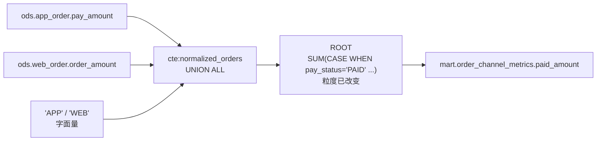
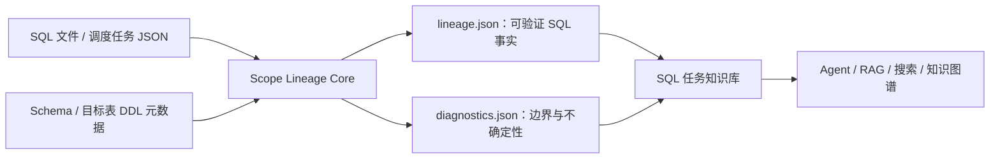

# Scope Lineage

[](https://github.com/realyin/scope-lineage/actions/workflows/ci.yml)
[](pyproject.toml)
[](LICENSE)

中文 | [English](README.md)

**把 Spark/Hive SQL 转换成结构化、可追溯的事实，供 Agent、RAG、搜索和 AI 知识库使用。**

> 普通血缘告诉你数据从哪里来；Scope Lineage 进一步告诉你，它是怎样一步一步变成当前字段的。

Scope Lineage 是一个离线静态分析器，把 CTE、子查询、字段表达式、JOIN、过滤、聚合、窗口和
不确定性保存为版本化的 `lineage.json` 与 `diagnostics.json`。上层 AI 可以引用可定位的证据，
不必根据原始 SQL 或简单的表级边猜测语义。

当前仓库包含开源 Core：SQL/任务输入、scope 解析、字段级血缘和诊断。它不需要 Spark 集群、
数据库凭据或大模型；向量化、知识图谱存储和业务语义生成属于下游能力。

如果你更关心这个工具怎样还原复杂字段的加工过程，可以先读
[《Scope Lineage：把复杂 SQL 还原成可验证的字段加工链》](docs/zh-CN/value-and-use-cases.md)。文档用一个完整的复杂 SQL
脱敏样例，演示字段解释、问题排查、变更评估和结果可信度判断。

## 直接看区别

字段级血缘本身并不稀缺。稀缺的是：在查询里最容易出错的地方给出正确答案，并且对证明不了的部分
保持诚实。

仓库内的 [`order_channel_metrics.sql`](examples/sql/order_channel_metrics.sql) 先用 `UNION ALL`
把两张来源表归一到一个 CTE，再做聚合：

```sql
WITH normalized_orders AS (
  SELECT pay_amount, pay_status, 'APP' AS order_channel
  FROM ods.app_order
  UNION ALL
  SELECT order_amount AS pay_amount, order_status AS pay_status, 'WEB' AS order_channel
  FROM ods.web_order
)
SELECT order_channel,
       SUM(CASE WHEN pay_status = 'PAID' THEN pay_amount ELSE 0 END) AS paid_amount
FROM normalized_orders
GROUP BY order_channel;
```



这里有两个地方容易出错。

**`order_channel` 是字面量，不是字段。** 作为对照，SQLLineage 1.5.8
（`sqllineage -f <file> -l column --dialect sparksql`）的输出是：

```text
mart.order_channel_metrics.order_channel <- normalized_orders.order_channel
```

这个字段并不存在——它的值是分支里写死的 `'APP'` 或 `'WEB'`。Scope Lineage 会把它记为生成值而
不是读取值：

```json
{
  "column": "order_channel",
  "source_kind": "generated",
  "physical_sources": [],
  "generated_sources": [
    {"source_type": "CONSTANT", "value": "'APP'", "transform": "CONSTANT"},
    {"source_type": "CONSTANT", "value": "'WEB'", "transform": "CONSTANT"}
  ]
}
```

**`paid_amount` 在两个分支里读的是不同名字的列。** 表达式被原样保留，两个分支都被解析回各自的
物理字段：

```json
{
  "column": "paid_amount",
  "transform": "AGGREGATE",
  "expression": "SUM(CASE WHEN `normalized_orders`.`pay_status` = 'PAID' THEN `normalized_orders`.`pay_amount` ELSE 0 END)",
  "physical_sources": [
    {"table": "ods.app_order", "column": "pay_amount",   "transform": "AGGREGATE"},
    {"table": "ods.web_order", "column": "order_amount", "transform": "AGGREGATE"},
    {"table": "ods.app_order", "column": "pay_status",   "transform": "AGGREGATE"},
    {"table": "ods.web_order", "column": "order_status", "transform": "AGGREGATE"}
  ],
  "trace_complete": true
}
```

以上两段都是真实产物节选，不是手写总结。可以用下面的命令复现：

```bash
scope-lineage parse \
  --sql-file examples/sql/order_channel_metrics.sql \
  --schema examples/metadata/schema_info.json \
  --target-ddl-metadata examples/metadata/target_tables \
  --out /tmp/scope-lineage
# 然后查看 /tmp/scope-lineage/order_channel_metrics/lineage.json 的 end_to_end_lineage
```

### 与 SQLLineage 的对比

| | SQLLineage 1.5.8 `-l column` | Scope Lineage |
| --- | --- | --- |
| CTE / JOIN 字段血缘 | 可以解析 | **来源集合一致——两者打平** |
| 字面量字段 | 报成一个并不存在的列 | `generated_sources` 中的 `CONSTANT` |
| UNION 分支追到物理表 | 部分字段停在 CTE | 按分支分别解析 |
| 带 Schema 的 `SELECT *` | `mart.t.* <- ods.s.*` | 展开为具体字段 |
| 变换类型与表达式 | 不提供 | `DIRECT` / `EXPRESSION` / `AGGREGATE` / `CONDITIONAL` 及 SQL |
| 目标字段按 DDL 位置绑定 | 不提供 | `target_field_binding`、序号 |
| 多写语句脚本 | 合并为一份结果 | 每条写语句一套独立产物 |
| 无法证明的部分 | 不提供 | `diagnostics.json` |

也要说清楚哪里**没有**差别：在
[`customer_profile_daily.sql`](examples/sql/customer_profile_daily.sql) 这类常规 CTE + JOIN 任务
上，两个工具对每个目标字段给出的物理来源集合完全相同。差异在于每条边上附带的证据——表达式、
变换类型、粒度变化和诊断信息——而不是边本身。

同一任务还会识别窗口/去重角色、区分 JOIN key 与行过滤条件、按目标 DDL 位置绑定字段，并显式
报告无法证明的事实。完整结构见 [`lineage.json` 输出契约](docs/zh-CN/lineage-json.md)。

## 这些事实可以支持什么问题

把一批 SQL 产物建立索引后，上层应用可以回答：

- `customer_profile_snapshot.order_count_30d` 是怎样计算出来的？
- 哪些目标字段依赖 `dwd.order_detail.order_id`？
- 哪些任务使用 `ROW_NUMBER` 做去重？
- 哪些血缘链路不完整或存在歧义，原因是什么？

## 这些事实为什么对 AI 有价值

| 原始 SQL 的问题 | Scope Lineage 提供的事实 | 上层可以可靠实现的能力 |
| --- | --- | --- |
| SQL 太长，直接塞给模型成本高且容易漏逻辑 | `scope_profile.steps[]`、scope 图和结构化逻辑块 | 分层检索、任务摘要、按查询块解释 |
| 只有表级边，无法回答字段从哪里来 | `end_to_end_lineage[].physical_sources[]` | 字段影响分析、字段知识图谱、变更问答 |
| 只知道最终来源，不知道中间怎么算 | `field_mapping_chains[].ordered_steps[]` | 展示字段逐步变换证据，解释指标计算过程 |
| JOIN/过滤/聚合被压成一段文本 | `logic_blocks[]` 及 join/filter/aggregation/window detail | 结构化搜索规则、治理审查、逻辑对比 |
| SQL 别名和目标字段名不一致 | `target_field_binding` 和目标字段位置 | 按 DDL 权威顺序建立正确目标字段血缘 |
| 大模型容易把歧义当成确定答案 | `trace_complete`、`ambiguities`、`lineage_fact_gaps` | 带可信度的 RAG，拒绝无证据推断 |
| 调度依赖和 SQL 表依赖分散 | `task_dependencies` + `scope_graph` + `source_tables` | 任务、表、字段多层知识图谱 |

Scope Lineage 的价值不是替 AI 写一段固定总结，而是提供可复算、可定位、可校验的事实。上层生成的每条业务解释都可以回到具体 scope、表达式、字段来源和诊断证据。

## 它能做什么

- 面向 Spark/Hive 数仓 SQL，离线静态解析，不需要连接 Spark 集群或执行 SQL；
- 接收单个 `.sql`、真实调度任务 JSON，或递归任务目录；
- 支持 `INSERT INTO`、`INSERT OVERWRITE`、CTAS 和 `MERGE` 写表语句；
- 保留 CTE、子查询、JOIN、UNION/UNION ALL、聚合、窗口函数和中间 scope；
- 生成字段映射、表达式、物理源字段、端到端字段血缘和 scope 依赖图；
- 结合可选 Schema 元数据展开 `SELECT *`，补充字段类型和注释；
- 结合目标表 DDL/Schema 元数据，按权威字段顺序绑定 INSERT 投影；
- 从任务 JSON 保留声明的上下游任务依赖；
- 对无法解析、语法恢复、歧义引用和元数据缺失给出显式状态与诊断，不把猜测伪装成事实；
- 通过版本化 JSON Schema 和写盘前校验，为 AI 与其他下游提供稳定契约。

## 面向 AI 知识库的工作方式



Core 负责确定性解析和事实表达，不负责替用户选择向量数据库、图数据库或大模型。这样的边界使
同一份解析结果可以服务代码检索、任务问答、影响分析、治理审查和后续业务知识生成。

## 为什么还需要这个项目

开源生态已经有成熟能力，本项目并不宣称自己是第一个 SQL 解析器或血缘工具：

- [SQLGlot](https://github.com/tobymao/sqlglot) 是通用 SQL 解析、转译和优化引擎，也是本项目的底层依赖；
- [SQLLineage](https://sqllineage.readthedocs.io/) 提供通用表级和字段级 SQL 血缘；
- [OpenLineage](https://openlineage.io/docs/guides/spark/) 侧重从运行中的 Spark 作业采集标准化血缘事件；
- [DataHub](https://github.com/datahub-project/datahub/blob/master/docs/api/tutorials/lineage.md) 是完整元数据平台，也能从 SQL 推断字段血缘。

Scope Lineage 的差异化方向，是专注 Spark/Hive 离线任务，把中间 scope、字段变换、任务依赖、
元数据补全、端到端证据和解析诊断统一成面向 AI 知识库的版本化事实契约。根据目前可见的上述
项目官方定位，我们尚未发现一个与这一完整目标和输出边界完全相同的开源工具；这是项目要验证
和持续建设的方向，不是“没有其他 SQL 血缘方案”的绝对结论。

## 安装

推荐使用 `pipx` 从 PyPI 安装独立的 CLI 环境：

```bash
pipx install scope-lineage
scope-lineage --help
```

也可以在 Python 虚拟环境中安装：

```bash
python3 -m venv .venv
source .venv/bin/activate
python -m pip install scope-lineage
```

参与开发时再从源码安装：

```bash
git clone https://github.com/realyin/scope-lineage.git
cd scope-lineage
python3 -m venv .venv
source .venv/bin/activate
python -m pip install --upgrade pip
python -m pip install .
```

PyPI distribution 和 CLI 名均为 `scope-lineage`，Python import namespace 为
`scope_lineage`。当前 `0.1.x` 系列处于 Alpha 阶段。首次使用请阅读
[安装与使用指南](docs/zh-CN/getting-started.md)。

## 快速开始

### 1. 解析一个 SQL 文件

```bash
scope-lineage parse \
  --sql-file examples/sql/customer_profile_daily.sql \
  --schema examples/metadata/schema_info.json \
  --target-ddl-metadata examples/metadata/target_tables \
  --out /tmp/scope-lineage
```

### 2. 解析真实格式的任务 JSON

```bash
scope-lineage parse \
  --task-file examples/tasks/customer/customer_profile_daily.json \
  --schema examples/metadata/schema_info.json \
  --target-ddl-metadata examples/metadata/target_tables \
  --out /tmp/scope-lineage
```

任务导出格式与当前语料一致：

```json
{
  "meta": {
    "task_id": "demo-task-1002",
    "task_name": "customer_profile_daily",
    "input_tables": ["ods.customer_base", "dwd.order_detail"],
    "output_tables": ["mart.customer_profile_snapshot"],
    "upstream_tasks": [
      {"task_id": "demo-task-1001", "task_name": "order_detail_daily"}
    ],
    "downstream_tasks": [],
    "sql": "INSERT OVERWRITE TABLE ..."
  },
  "query_time": "2026-08-02 10:00:00",
  "data_source": "scheduler_api_demo"
}
```

完整示例保留了任务类型、项目、负责人、调度、描述、输入输出表、依赖、实例和时间等实际字段；
Core 当前只消费解析需要的任务名、SQL 和依赖信息。

### 3. 批量解析任务目录

```bash
scope-lineage parse \
  --input-dir examples/tasks \
  --schema examples/metadata/schema_info.json \
  --target-ddl-metadata examples/metadata/target_tables \
  --out /tmp/scope-lineage-corpus
```

目录会递归发现 `*.json`。嵌套目录结构会保留到输出目录中；一个任务包含多条支持的写表语句时，
每条语句分别生成产物。只有调用方明确接受失败输入或失败语句时，才使用 `--allow-partial`。

任务级 2.0 契约现在是默认值：每个任务一份有序的表状态产物，保留语句顺序，并建模
DELETE、TRUNCATE、UPDATE、字段值与行集合影响：

~~~bash
scope-lineage parse \
  --task-file examples/tasks/customer/customer_profile_daily.json \
  --schema examples/metadata/schema_info.json \
  --schema-fallback examples/metadata/schema_info.csv \
  --quality-policy strict \
  --out /tmp/scope-lineage-v2
~~~

详见 [Task Lineage 2.0](docs/zh-CN/task-lineage-v2.md)。

### 从 1.0 迁移到任务契约

契约 1.0（每条投影写一份产物，`--contract-version 1.0`）已弃用，计划在 0.2.0 之后的
一个 minor 版本移除。迁移主要是"重新指向"：

- v2 文档的 `statement_lineage` 以 `statement_id` 为键，每个条目就是完整的 v1 语句文档
  形状，顺序由 `statement_sequence` 给出——原来消费 v1 `lineage.json` 的代码可以原样消费
  单个条目。
- 任务级问题上移一层：`end_to_end_lineage`（最终态视图）、`table_state_graph`、
  `final_table_states`、`task_dependencies` 是 v1 没有的顶层事实。
- `render` 与 `render_mapping_markdown` 两种形状都接受；任务文档按语句逐节渲染。
- 库函数 `write_lineage`（v1 产物写入器）会发出 `DeprecationWarning`，由
  `write_task_lineage` 取代；语句转换器 `to_lineage_dict` 保留不弃用。

对已生成的产物再渲染一份人和机器都可读的字段映射文档 `mapping.md`：

```bash
scope-lineage render --lineage /tmp/scope-lineage-corpus
```

每条写语句的 `mapping.md` 默认写在其 `lineage.json` 旁（`--out` 可镜像输出到其他目录）。
该文档是契约的派生视图，其中每条事实都可按契约 ID 连回 `lineage.json`。
详见 [mapping.md 字段映射文档](docs/zh-CN/mapping-doc.md)。

更多完整输入见 [examples/README.zh-CN.md](examples/README.zh-CN.md)，字段级说明见
[Core 输入格式](docs/zh-CN/input-formats.md)。

### 4. 配置 catalog 前缀规范化

Core 默认保留 SQL 中的完整表名。例如 `warehouse_catalog.ods.orders` 会原样写入
`source_tables` 和字段物理来源。如果同一个环境同时使用 `warehouse_catalog.ods.orders` 与
`ods.orders` 表示同一张物理表，应显式声明可剥离的 catalog：

```bash
scope-lineage parse \
  --input-dir examples/tasks \
  --catalog-prefixes warehouse_catalog,spark_catalog \
  --out /tmp/scope-lineage-corpus
```

也可以为 Python API 或固定部署环境设置：

```bash
export SCOPE_LINEAGE_CATALOG_PREFIXES="warehouse_catalog,spark_catalog"
```

命令行参数优先于环境变量；两者都未设置时不剥离任何 catalog。这里只能填写确认属于 catalog
的首段名称，不要填写 database 名。catalog 规范化是同一批任务共享的解析策略，不是单个任务的
业务事实，因此不写入任务 JSON；不同 catalog 策略的任务应分批运行。完整规则见
[Core 输入格式：catalog 前缀配置](docs/zh-CN/input-formats.md#catalog-前缀配置)。

## 输入元数据

源表 Schema 推荐使用带 `columnIndex` 和 DDL 的富 JSON；DDL 能解析时以 DDL 字段顺序为准，
否则按 `columnIndex` 排序：

```json
{
  "table_name": "ods.customer_base",
  "schema": [
    {"columnName": "customer_id", "columnType": "bigint", "columnIndex": 0},
    {"columnName": "customer_name", "columnType": "string", "columnIndex": 1}
  ],
  "ddl": "CREATE TABLE ods.customer_base (customer_id BIGINT, customer_name STRING)"
}
```

CSV 是兼容候补格式，按同一张表在文件中的行序作为字段顺序：

```csv
table_name,column_name,column_type,column_comment
ods.customer_base,customer_id,bigint,Synthetic customer identifier
ods.customer_base,customer_name,string,Synthetic customer name
```

CSV 没有显式 `columnIndex` 或 DDL 校验；如果导出端不能保证行序，不应依赖它展开
`SELECT *`。富 JSON 文件或目录可以传给 `--schema`；`--target-ddl-metadata` 接收同一结构的
单个 JSON 或目录，每份文件描述目标表名、
`schema[].columnIndex`、分区、DDL 和元数据版本。可解析的 DDL 是目标结构和顺序的首要依据。
源表 Schema 用于字段解析和 `SELECT *` 展开，目标表元数据用于权威 INSERT 字段绑定，两者用途不同。

## 输出

每条写表语句只生成两份 Core 产物：

```text
<output>/<task-id>/
├── lineage.json
└── diagnostics.json
```

### `lineage.json`：已解析事实

| 字段组 | 关键 key | 回答的问题 |
| --- | --- | --- |
| 任务与写入 | `task_id`、`target_table`、`stmt_kind`、`target_partition_*` | 谁写入哪张表、如何分区？ |
| 物理来源 | `source_tables`、`related_metadata` | 读取哪些表和字段，类型/注释是什么？ |
| 查询结构 | `scopes`、`scope_graph` | CTE、子查询、UNION、ROOT 如何连接？ |
| SQL 逻辑 | `logic_blocks`、`input_source_refs` | 在哪里 JOIN、过滤、聚合、开窗？alias 如何绑定？ |
| 字段过程 | `scopes.*.outputs`、`field_mapping_chains` | 字段表达式是什么，经历了哪些 scope 和变换？ |
| 最终血缘 | `end_to_end_lineage` | 每个目标字段最终来自哪些物理字段或生成值？ |
| 可信度 | `trace_complete`、`missing_reasons`、`ambiguities` | 这条事实是否完整，哪里仍不确定？ |

### `diagnostics.json`：边界与缺口

它保存：

- `warnings[]`：warning 类型、发生 scope 和证据消息；
- `stats`：scope、表、JOIN、UNION、CASE、窗口和聚合数量；
- `lineage_fact_gaps[]`：缺口类型、受影响字段、缺失事实、证据路径和下游影响。

AI 下游必须同时读取诊断，不能把 `recovered`、歧义候选或缺失元数据当成已经证明的血缘事实。

详细文档：

- [安装与使用指南](docs/zh-CN/getting-started.md)
- [文档导航与问题—字段索引](docs/zh-CN/README.md)
- [`lineage.json` 全部核心 key/value、嵌套结构和消费示例](docs/zh-CN/lineage-json.md)
- [`diagnostics.json` warning、stats 和 fact gap 字段说明](docs/zh-CN/diagnostics-json.md)
- [SQL、任务 JSON、Schema 和目标 DDL 输入格式](docs/zh-CN/input-formats.md)
- [`mapping.md` 字段映射文档](docs/zh-CN/mapping-doc.md)

## Python API

```python
from scope_lineage import parse_scope_lineage, to_lineage_dict, write_lineage

result = parse_scope_lineage(
    "INSERT INTO mart.user_ids SELECT id FROM ods.users",
    task_name="user_ids",
    schema={"ods.users": ["id"]},
)

document = to_lineage_dict(result)
write_lineage(result, "/tmp/scope-lineage/user_ids")
```

稳定公共面由 `scope_lineage.PUBLIC_CORE_API` 显式声明。下游应使用公共门面或读取 JSON 契约，
不要穿透导入内部实现模块。

## 契约与限制

两份输出当前要求 `schema_version: "1.0"` 并在写盘前校验。同一 major 版本内，消费者应容忍
新增可选字段；删除、改名或改变字段语义必须升级 major。

- [Lineage JSON 契约](docs/zh-CN/lineage-json.md)
- [Diagnostics JSON 契约](docs/zh-CN/diagnostics-json.md)
- [Core 输入格式](docs/zh-CN/input-formats.md)

当前限制：

- 只做静态分析，不判断 SQL 在真实 Spark 集群上能否成功执行；
- 独立 `UPDATE`/`DELETE` 不属于当前字段投影模型，`MERGE` 内的更新/插入分支受支持；
- 动态 SQL、模板展开和平台自定义语法可能需要调用方先预处理；
- 缺少 Schema 时，`SELECT *` 可能保留显式降级占位；
- Scope Lineage 提供知识库事实输入，但本身不是完整的知识库产品。

## 开发验证

```bash
python -m pytest -q tests/core
python -m ruff check scope_lineage tests
python -m build
python tests/architecture/verify_distribution.py dist/*
```

提交前请阅读 [CONTRIBUTING.md](CONTRIBUTING.md) 和 [SECURITY.md](SECURITY.md)。所有测试和示例
必须使用合成数据，不得包含私有 SQL、内部标识符或本机路径。

## License

Apache License 2.0，见 [LICENSE](LICENSE)。
